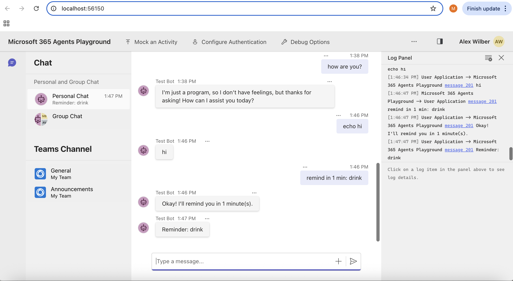
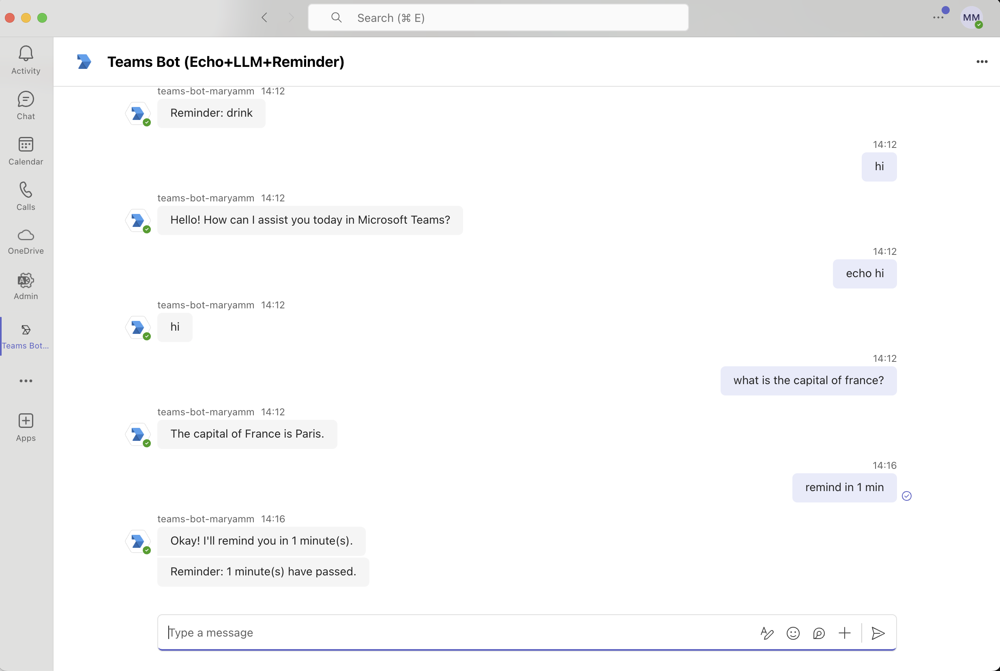

# Python Teams Bot (Echo + HF LLM + Reminders)

## Features
- Echo: `echo <text>`
- Free text via Hugging Face LLM
- Reminders: `remind in N minutes[: message]`

Containerized with Docker, tested via **Microsoft 365 Agents Playground** and in real **Microsoft Teams**.


## 1) Prerequisites

- Docker (latest)
- ngrok (for Teams)  
- Hugging Face token   
- Azure App Registration (App ID/secret/tenant) for **real Teams**

Copy and fill your envs:
```bash
cp .env.example .env
```

## 2) Build

Build the Docker image from the repository root:

```bash
docker build -t teams-bot:local .
```

## 3) Local testing in **Agents Playground** (no authentication required)

Run the bot **without** Microsoft credentials (Playground/emulator mode):

```bash
docker run --rm -p 3978:3978 --name teams-bot \
  -e HUGGINGFACE_API_TOKEN="$HUGGINGFACE_API_TOKEN" \
  -e HF_MODEL="Qwen/Qwen2.5-7B-Instruct-1M" \
  teams-bot:local
```

Start the Playground and point it to your endpoint:
```bash
npx -y -p @microsoft/teams-app-test-tool \
  teamsapptester start --app-endpoint http://localhost:3978/api/messages
```

Or you can use the newer version
```bash
agentsplayground -e "http://localhost:3978/api/messages" -c "emulator"
```



*Playground showing the echo, llm conversation and reminder functionality.*
  

## 5) Run in **Microsoft Teams** (real bot)

### 5.1 Run the container **with credentials**
Start the bot with Azure App Registration values:

```bash
docker run --rm -p 3978:3978 --name teams-bot \
  -e MicrosoftAppType="SingleTenant" \
  -e MicrosoftAppId="<APP_ID>" \
  -e MicrosoftAppPassword="<APP_SECRET>" \
  -e MicrosoftAppTenantId="<TENANT_ID>" \
  -e HUGGINGFACE_API_TOKEN="$HUGGINGFACE_API_TOKEN" \
  -e HF_MODEL="Qwen/Qwen2.5-7B-Instruct-1M" \
  teams-bot:local
```
### 5.2 Expose locally via ngrok
```bash
ngrok http 3978
```
### 5.3 Azure Bot configuration (Azure Portal)
1. Go to your **Azure Bot (Bot Channels Registration)** resource.  
2. **Configuration** → set **Messaging endpoint** to your current ngrok URL **including** the path:
https://<your-ngrok>.ngrok-free.app/api/messages

3. **Channels** → ensure **Microsoft Teams** is **Added** and shows **Running**.
4. **Test in Web Chat** if available, or send a quick message from Teams after saving.

### 5.4 Install / Update the Teams app (Developer Portal)

1. Open **Developer Portal for Teams** and select your app.
2. Go to **App features → Bot** and choose **Use existing**, then paste your **Microsoft App ID**.
3. Go to **Domains & permissions** and add your ngrok host
4. Publish → Download app package.
5. Teams → Apps → Manage your apps → Upload a custom app → select ZIP → Add.


### 5.5  Test in Teams


*Teams Bot showing the echo, llm conversation and reminder functionality.*


## Project Layout
```
.
├── src/
│   └── bot/
│       ├── app.py            # aiohttp + BotFramework routing (echo, LLM, reminders)
│       ├── llm_hf.py         # Hugging Face Inference API client
│       ├── scheduler.py      # APScheduler
│       └── storage.py        # in-memory conversation references
├── Dockerfile                # container image (Poetry-based)
├── pyproject.toml            # Poetry dependencies & project metadata
├── poetry.lock               # locked dependency versions
├── README.md                 # setup + Playground + Teams instructions
├── .env.example              # placeholder env vars
├── .gitignore                # ignores real .env files, etc.
├── docs/
│   └── screenshots/          # images referenced in README
│       ├── playground_test_screenshot.png
│       ├── Teams_bot_screenshot.png

```